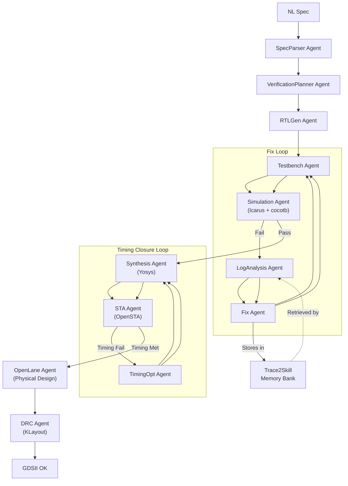

# RTL2GDS Agent

Autonomous multi-agent AI system that converts natural language chip specifications into verified, DRC-clean GDSII layout.


---

## Value Proposition

This project is an autonomous multi-agent AI system that converts natural language chip specifications into verified, DRC-clean GDSII layout. It uses a LangGraph state machine with 12 specialized AI agents working together -- from spec parsing through RTL generation, verification, synthesis, and physical design. The key novelty is the Trace2Skill persistent memory system that learns from past fixes using a two-phase confirm/reject protocol. Proven results: 25/25 pipeline passes, 90% bug fix rate, 5/5 benchmarks from natural language spec to clean GDSII. Average V1/V2 pipeline runtime is 23 seconds per benchmark.

---

## Architecture



---

## Results

| Metric | Value |
|---|---|
| V1 Simulation Pass Rate | 25/25 (100%) |
| V2 Synthesis Success | 5/5 (100%) |
| V2 STA Timing Met (100 MHz) | 5/5 (100%) |
| V3 GDSII Production | 5/5 (100%) |
| V3 DRC Clean | 5/5 (100%) |
| V3 LVS Clean (OpenLane built-in) | 5/5 (100%) |
| Bug Detection Rate | 10/10 (100%) |
| Bug Repair Rate | 9/10 (90%) |
| Bug Repair Rate (effective) | 8/10 (80%) |
| Average Fix Iterations | 1.3 |
| Convergence Events | 0/10 (0%) |
| Average V1/V2 Runtime | ~23 s per benchmark |
| Average V3 Runtime (approximate) | ~20-45 min per benchmark |

---

## Supported Benchmarks

| Benchmark | Type | Cells | Area (um^2) | GDSII | DRC | Timing @ 100 MHz |
|---|---|---|---|---|---|---|
| alu_8bit | Combinational | 131 | 778.25 | Yes | CLEAN | WNS = 6.59 ns |
| sync_fifo_8x16 | Sequential (FIFO) | 648--649 | 5939--5951 | Yes | CLEAN | WNS = 0.05 ns |
| fsm_traffic_light | Sequential (FSM) | 10 | 160.15 | Yes | CLEAN | WNS = 6.41 ns |
| uart_tx | Sequential | 180 | 1712.89 | Yes | CLEAN | WNS = 0.07 ns |
| apb_slave | Protocol | 527 | 5497.77 | Yes | CLEAN | WNS = 3.88 ns |
| axi4_lite_slave | Protocol | -- | -- | In progress | -- | -- |
| i2c_master | Protocol | -- | -- | In progress | -- | -- |
| spi_master | Protocol | -- | -- | In progress | -- | -- |

---

## Quickstart

### Prerequisites

- Python 3.11+
- Icarus Verilog (`iverilog`)
- cocotb 2.x
- Yosys
- OpenSTA
- Docker (for OpenLane 2)
- KLayout

### Run a Benchmark

```bash
git clone https://github.com/ShashankT-ECE/rtl2gds-agent.git
cd rtl2gds-agent
python3 -m venv .venv && source .venv/bin/activate
pip install -r requirements.txt
cp .env.example .env   # then edit .env with your DEEPSEEK_API_KEY
# or: export DEEPSEEK_API_KEY="your-key-here"

# V1: simulation only
python3 main.py --benchmark alu_8bit

# V2: simulation + synthesis + STA
python3 main.py --benchmark alu_8bit --v2

# V3: full RTL-to-GDSII with DRC
python3 main.py --benchmark alu_8bit --v3
```

### Expected Output (V3)

```
══════════════════════════════════════════════
Starting V3 pipeline for: alu_8bit
══════════════════════════════════════════════
[SpecParser] Ports: A(8), B(8), opcode(3), Y(8), zero_flag(1)
[VerificationPlanner] 3-tier plan generated
[RTLGen] Using reference RTL -- skipping LLM generation
[Simulation] Simulation PASSED OK
[Synthesis] Cells: 131, Area: 778.25
[STA] Combinational -- STA skipped
[OpenLane] GDS: workspace/physical/alu_8bit/runs/.../alu_8bit.gds
[DRC] DRC CLEAN -- zero violations OK
══════════════════════════════════════════════
Pipeline COMPLETE -- alu_8bit GDSII produced, DRC clean
══════════════════════════════════════════════
```

---

## Pipeline Versions

| Version | What It Does | Runtime |
|---------|-------------|---------|
| **V1** (Simulation Loop) | NL spec -> RTL -> testbench -> simulation -> auto-fix loop | ~20--30 s |
| **V2** (Synthesis + STA) | V1 + Yosys synthesis + OpenSTA timing analysis + timing opt loop | ~30--60 s |
| **V3** (Physical Design) | V2 + OpenLane 2 floorplan-to-GDSII + KLayout DRC | ~20--45 min |

---

## Trace2Skill Memory System

Trace2Skill is a persistent, JSON-based skill bank that stores successful RTL bug fixes as structured entries. Instead of relying on vector embeddings or neural memory, it uses simple pattern matching: each skill records the error type, the error pattern observed in simulation logs, and the exact fix that resolved it. Agents retrieve relevant skills by matching error type and keywords from the simulation log against stored patterns.

The system implements a **two-phase confirm/reject protocol** that prevents low-quality entries from accumulating. When the Fix Agent generates a repair, it tentatively stores a skill with `confirmed_count = 0`. Only after the subsequent simulation run passes does the pipeline confirm the skill (incrementing `confirmed_count`), making it visible to future retrievals. If simulation fails, the tentative skill is removed automatically. This protocol ensures that only verified fixes enter the active memory bank.

Current skill bank composition:

- **combinational**: 6 skills
- **fsm**: 27 skills
- **fifo**: 8 skills
- **axi**: 9 skills
- **timing**: 2 skills
- **Total**: 52 skills across 5 categories

When a simulation fails, the LogAnalysis agent retrieves candidate skills from the matching category. The Fix Agent checks these before calling the LLM, reusing proven fix patterns and reducing iteration count. Skills with `curated = True` (manually verified) are always ranked highest in retrieval results.

---

## Tech Stack

| Layer | Technology |
|---|---|
| LLM Inference | DeepSeek API / Fireworks AI / Anthropic / Ollama (provider-agnostic router) |
| Agent Framework | LangGraph (Python) |
| RTL Simulation | Icarus Verilog + cocotb 2.x |
| Synthesis | Yosys |
| Static Timing | OpenSTA |
| Physical Design | OpenLane 2 (via Docker) |
| DRC | KLayout |
| PDK | SkyWater 130 nm (sky130_fd_sc_hd) |
| Containerization | Docker |

---

## Project Structure

```
rtl2gds-agent/
├── main.py                    # CLI entry point for V1 / V2 / V3 pipelines
├── v1_core/                   # V1: Simulation + fix loop
│   ├── pipeline.py            # LangGraph graph builder
│   ├── agents/                # SpecParser, RTLGen, TBGen, Simulation, LogAnalysis, Fix
│   ├── mcp_tools/             # Icarus/cocotb simulation server
│   └── utils/                 # model_router.py, trace2skill.py
├── v2_verification/           # V2: Synthesis + STA
│   ├── pipeline.py            # V2 LangGraph extension
│   ├── agents/                # Synthesis, STA, TimingOpt
│   └── mcp_tools/             # Yosys, OpenSTA wrappers
├── v3_physical/               # V3: Physical design
│   ├── pipeline.py            # V3 LangGraph extension
│   ├── agents/                # OpenLane, DRC
│   └── mcp_tools/             # Docker-based OpenLane, KLayout
├── skills/                    # Trace2Skill memory bank (JSON files by category)
├── benchmarks/                # 8 RTL benchmarks with specs, RTL, testbenches, and bugs
│   ├── alu_8bit/
│   ├── sync_fifo_8x16/
│   ├── fsm_traffic_light/
│   ├── uart_tx/
│   ├── apb_slave/
│   ├── axi4_lite_slave/
│   ├── i2c_master/
│   └── spi_master/
├── pdk/sky130/                # SkyWater 130 nm Liberty timing files
├── workspace/                 # Runtime outputs (RTL, netlists, GDSII)
├── docs/                      # Evaluation reports and analysis
├── docker/                    # Dockerfiles for simulation and synthesis containers
└── CLAUDE.md                  # Project instructions for Claude Code
```

---

## Contributing

This project is currently in active development for the Tessolve Semiconductors demo. Contributions and ideas are welcome -- open an issue or pull request on GitHub.

---

## Citation

If you use this work in research, please cite:

```bibtex
@software{tumuluri2025rtl2gds,
  author = {Tumuluri, Shashank},
  title = {RTL2GDS Agent: AI-Driven Automated RTL-to-GDS Framework},
  year = {2026},
  url = {https://github.com/ShashankT-ECE/rtl2gds-agent}
}
```

---

## License

MIT
